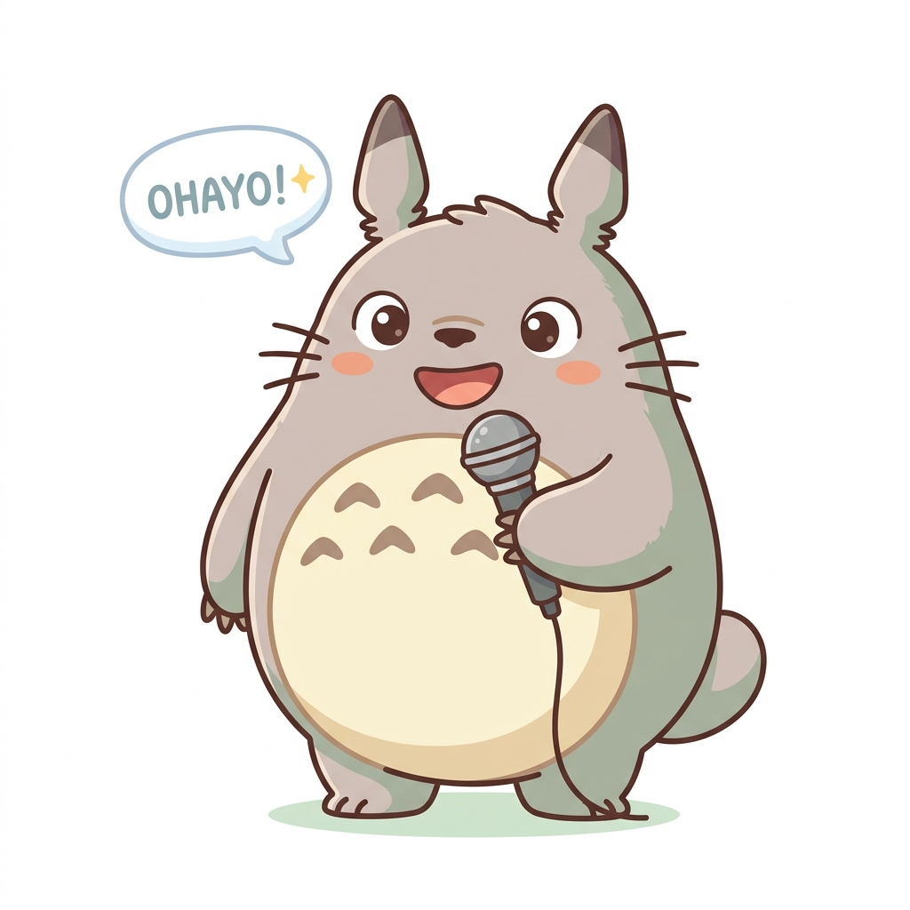

# VoiceRead 🍃

**Tu amigo lector** — Un reproductor de Text-to-Speech moderno, divertido y completamente funcional que convierte texto en voz directamente en tu navegador.

<p align="center">
  
</p>

<p align="center">
  <strong>Sin backend · Sin dependencias · Sin APIs externas</strong>
</p>

---

## ✨ Características

- 🎙️ **Text-to-Speech nativo** — Usa la Web Speech API del navegador
- 🎨 **Diseño Duolingo + Totoro** — Interfaz amigable, colorida y profesional
- 📱 **Mobile-first** — Diseñado para verse y funcionar genial en celular
- 🔊 **Controles completos** — Play, Pause, Stop, Restart, Skip
- 📊 **Barra de progreso interactiva** — Clic o arrastra para saltar a cualquier posición
- ✨ **Resaltado de palabras** — Ve qué palabra se está leyendo en tiempo real
- 🎛️ **Velocidad y tono** — Ajusta de 0.5x a 2.0x
- 🌍 **Múltiples voces** — Selecciona entre todas las voces disponibles en tu navegador
- 💾 **Guardado automático** — Tu texto y preferencias se guardan en localStorage
- ⌨️ **Atajos de teclado** — Space, Esc, R
- ♿ **Accesible** — ARIA labels, navegación por teclado, HTML semántico
- 🐾 **Mascota interactiva** — Totoro cambia según el estado de la app

## 📸 Screenshots

| Mobile | Desktop |
|--------|---------|
|  |  |

## 🚀 Cómo usar

1. **Clona el repositorio**

```bash
git clone https://github.com/tu-usuario/voiceread.git
cd voiceread
```

2. **Abre `index.html`** en tu navegador

```bash
# macOS
open index.html

# Windows
start index.html

# Linux
xdg-open index.html
```

¡Eso es todo! No necesitas servidor, ni npm, ni nada más.

## 🛠️ Tecnologías

| Tecnología | Uso |
|-----------|-----|
| HTML5 | Estructura semántica |
| CSS3 | Diseño y animaciones |
| JavaScript ES6+ | Lógica de la aplicación |
| Web Speech API | Síntesis de voz |
| Google Fonts (Nunito) | Tipografía |
| localStorage | Persistencia de preferencias |

## 📁 Estructura del proyecto

```
voiceread/
├── index.html          # Página principal
├── styles.css          # Estilos y diseño responsive
├── script.js           # Lógica TTS y estado de la app
├── img/                # Imágenes del mascota Totoro
│   ├── totoro-speaking.png
│   ├── totoro-sleeping.png
│   ├── totoro-paused.png
│   ├── totoro-celebrate.png
│   ├── totoro-confused.png
│   └── totoro-running.png
├── README.md
├── LICENSE
└── .gitignore
```

## 🎮 Controles

| Acción | Botón | Atajo |
|--------|-------|-------|
| Reproducir / Pausar | ▶️ / ⏸️ | `Space` |
| Detener | ⏹️ | `Esc` |
| Reiniciar | 🔄 | `R` |
| Retroceder 10% | ⏮️ | — |
| Avanzar 10% | ⏭️ | — |

> **Nota:** Los atajos de teclado se desactivan cuando el cursor está dentro del campo de texto.

## 🐾 Estados del mascota

| Estado | Imagen | Descripción |
|--------|--------|-------------|
| Listo | 😴 Durmiendo | Esperando que escribas texto |
| Leyendo | 🎙️ Hablando | Totoro te lee el texto |
| Pausado | 🌂 Con sombrilla | Esperando para continuar |
| Completado | 🎉 Celebrando | ¡Terminó de leer! |
| Error | 😅 Confundido | Algo salió mal |

## 🌐 Compatibilidad

| Navegador | Soporte |
|-----------|---------|
| Chrome | ✅ Completo |
| Edge | ✅ Completo |
| Safari | ✅ Completo |
| Firefox | ⚠️ Parcial (boundary events limitados) |

## ⚡ Características técnicas

- **Evento `boundary`** para resaltado de palabras en tiempo real
- **Fallback automático** cuando `boundary` no está disponible
- **Seeking** mediante slice del texto y nueva utterance
- **Workaround para Chrome** que pausa speech en tabs ocultos
- **16px mínimo** en inputs para prevenir zoom en iOS
- **`env(safe-area-inset-bottom)`** para iPhones con notch
- **Header sticky** con backdrop-filter en mobile

## 📝 Licencia

Este proyecto está bajo la licencia [MIT](LICENSE).

---

<p align="center">
  Hecho con 🍃 y la Web Speech API
</p>
